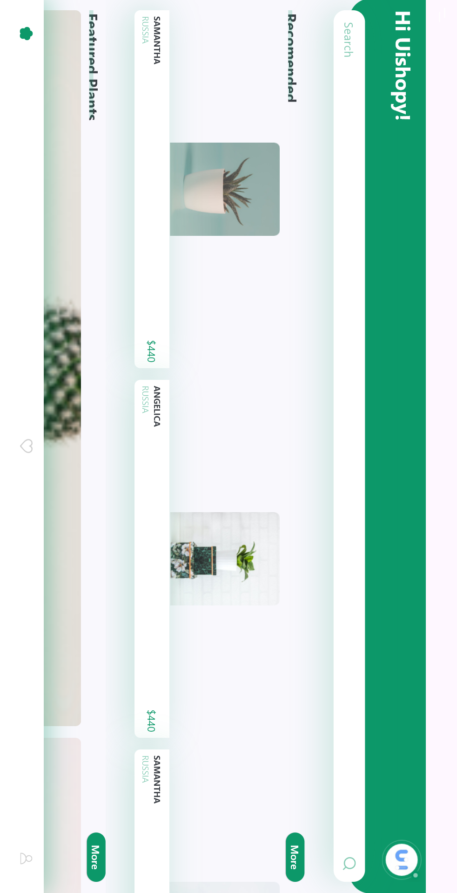
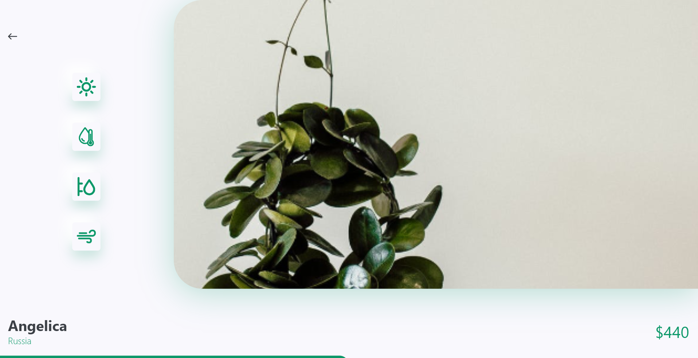

# PlantKart 🌿

**PlantKart** is a Flutter app for buying and selling plants online. It provides a clean, intuitive interface to browse, search, and view plants, along with their details and prices.  

---

## Features

- **Home Page**
  - Search bar to quickly find plants.
  - Horizontal scroll list of recommended plants.
  - Featured plants section in a grid/list layout.

- **Plant Details Page**
  - Large image of the selected plant.
  - Plant name, price, and country of origin.
  - Option to add plants to the cart.

- **Responsive UI**
  - Mobile-friendly layout with scrollable lists and smooth navigation.

---

## Screenshots

**Home Page:**  


**Details Page:**  


**Cart / Add to Cart:**  


---

## Packages Used

- [`flutter_svg`](https://pub.dev/packages/flutter_svg) – For rendering SVG images.  

---

## How It Works

1. **Home Screen**
   - Displays a horizontal list of recommended plants with image, name, country, and price.
   - Users can scroll horizontally to explore more plants.
   - Clicking a plant navigates to its details page.

2. **Details Screen**
   - Shows a larger image and details of the plant.
   - Includes interactive buttons like "Add to Cart".

3. **Navigation**
   - Uses `Navigator.push` to go from the Home screen to the Details screen.

---

## Getting Started

1. **Clone the repository:**

```bash
git clone https://github.com/Vishakha-20/PlantKart.git
